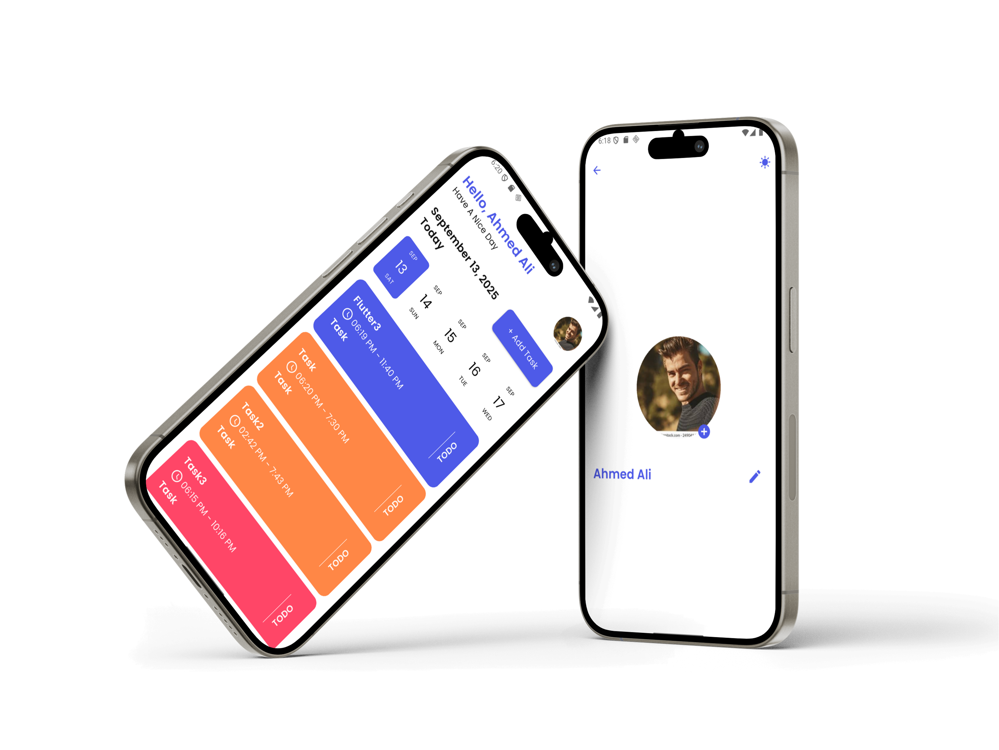

# taskati

# README.md
readme_content = """# Taskati App

Taskati is a simple Flutter application designed to help you organize your daily tasks.  
It allows you to upload your profile, add tasks, and manage them efficiently.

---

## 🚀 Features
- Splash screen with animated logo
- Upload profile photo (Camera/Gallery)
- Add tasks with title, description, date, start time, end time, and color selection
- Validation for inputs (name, date, etc.)
- Reusable widgets (custom text fields, buttons, labels)
- Error dialogs for missing inputs
- Add or Edit Tasks
- Dark Mode
- Edit Username and Userprofile

---

## 📸 Screenshots

### Splash & Upload Screen & Add Task Screen & Edit Profile

---

## 🛠️ Technologies Used
- **Flutter**
- **Dart**
- **Lottie Animations**
- **Image Picker Package**

---

📂 Project Structure

  lib/
│── core/
│   ├── constants/
│   ├── functions/
│   ├── text/
│   ├── utils/
│   └── widgets/
│── features/
│   ├── splash/
│   ├── upload/
│   ├── home/
│   ├── profile
│   └── add_task/

###Try the app (Android Release APK):
https://drive.google.com/file/d/1FxhddL60Yqv4bMhr8_CmsY2dx1CTw9Cl/view

- [LinkedIn](https://www.linkedin.com/in/moataz-mahmoud-a2a548a6/)  
- [Codeforces](https://codeforces.com/profile/El-Gazzar)

